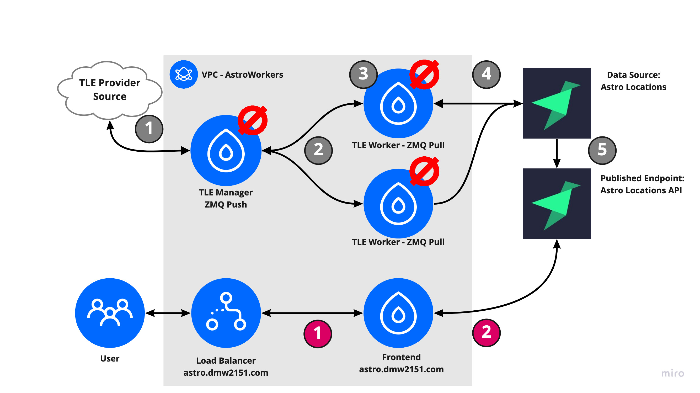
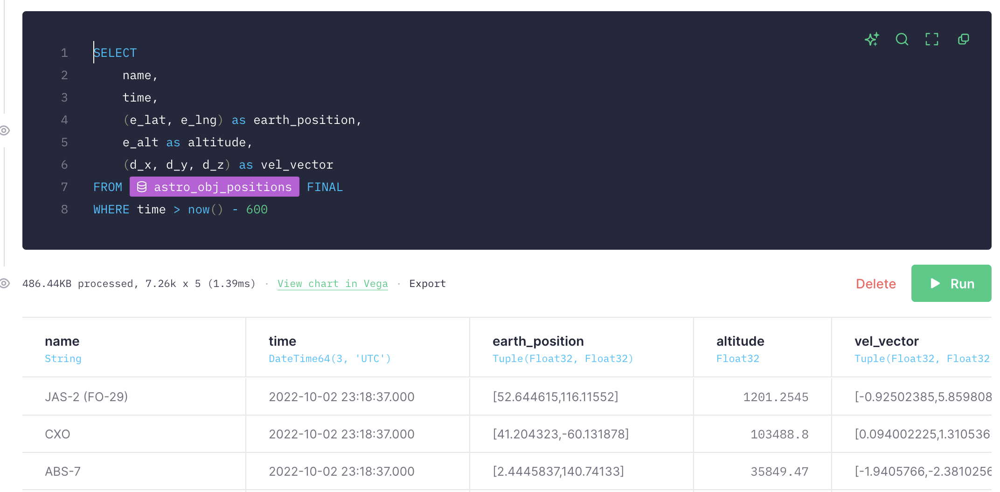

# Satellite Positions - TinyBird Demo


This repo manages a series of services that collect satellite data, stream data into TinyBird, and then use the TinyBird API to display that data in near real-time. ([demo](https://www.loom.com/share/c98404f69fca41c8b8298fc2d7436911))


||
|:--:|
| <a>**Sample Image - 04:00 UTC 10/1/2022** - *In the image above, orange represents objects in the STARLINK constellation, green represents those in the ONEWEB constellation, and red and blue represent Russian (Kosmos) and USA (USAF) operated objects respectively.*</a>|
| <a>**Note:** *scaled back from ~24000 to ~800 object-updates/min for rate-limiting concerns on live app*</a>|


## Architecture

The system uses the architcture shown below, the remainder of this document will discuss the choices made for this system.



**(1)** An async worker, `Manager`, downloads a series of Two-Line Elements (TLEs) from a TLE provider. A TLE is a file that defines the parameters of a satellite's orbit. Given a TLE and time, one can calculate the expected position of a satellite to within meters. Because orbits change, `Manager` updates the record of TLEs it maintains at some interval (default: 60 minutes).

**(2)** At some much shorter interval (default: 10 seconds), `Manager` pushes a message over a ZMQ socket containing the TLE parameters and the current time.

**(3)** `Worker` pulls messages off of ZMQ, and calculates the position and velocity of the satellite from the TLE and time. Because this calculation can be *slow*, we launch multiple instances of `Worker`, and use a push/pull model rather than a pub/sub model to distribute work.

**(4)** On completion, `Worker` posts a message to the TinyBird HFI API which writes to a datasource using a `ReplacingMergeTree` with time as the versioning key. Desite hundreds of requests/sec, this table will only ever grow to 10,000-20,000 objects because of the engine and version strategy.

**(5)** An API endpoint, `Astro`, is built on top of the datasource and made publicly-available.

### Notes + Optimizations

**TLEs** - Using TLEs rather than an external position API allows this service to generate messages on a schedule we define, and for a much wider set of objects in orbit (e.g. surely there is an API for the international space station, but there is likely not an API for [Ajisai](https://en.wikipedia.org/wiki/Ajisai)). Provided the TLE data (of which there is [plenty](https://celestrak.org/NORAD/elements/)) and the right scaling on `Worker` instances, this model would scale to 10,000s of objects in space with a <1s update frequency.

**ZMQ Push Pull Model** - A push/pull model allows for easier scaling of `Worker` instances than pub/sub. There's still work to do here, as the scaling isn't particuarly smart, but `docker-compose up --scale ($n+1)` on an inexpensive VM will take us well beyond 1000 req / s.

**Table and Query Optimizations** - Because we're only interested in the current position of an object, we can take care to keep our table only containing the most recent calculation result. We can do this easily in Clickhouse with a `ReplacingMergeTree`. This engine type removes duplicate entries with the same sorting key value. 

As this application runs with thousands of queued satellites, strategies like using an engine TTL, partitioning by date, etc. can be very helpful, but for this limited use case, `ReplacingMergeTree` will eventually beat other methods by orders of magnitude. See example below, scans \~8,000 and 500Kb despite hundreds of thousands of rows written in the last hour.



**Async Requests to HFI Endpoint** - Making 100s req/s involves being a bit loose w. HTTP requests, because any individul position update is relatively unimportant, HTTP requests to the HFI API are all fire-and-forget (save for a rate-limiting callback). This allows us to keep the number of `Worker` instances limited to what we need for the CPU-bound computation, not what we need for the POST to TB (example below).

```python
%%time
r = requests.post(
    "https://api.tinybird.co/v0/events",
    params={
        "name": "events_example",
        "token": TOKEN,
    },
    data=data,
)
print(r.ok)
```

```bash
True
CPU times: user 18.1 ms, sys: 5.14 ms, total: 23.3 ms
Wall time: 99.2 ms
```

```python
%%time
start = time.time()
p.apply_async(
    requests.post,
    kwds={
        "url": "https://api.tinybird.co/v0/events",
        "params": {
            "name": "events_example",
            "token": TOKEN,
        },
        "data": data,
    },
    callback=(lambda x: print(time.time() - start, x.ok)),
)
```

```bash
CPU times: user 114 µs, sys: 4 µs, total: 118 µs
Wall time: 123 µs
0.11641287803649902 True
```
